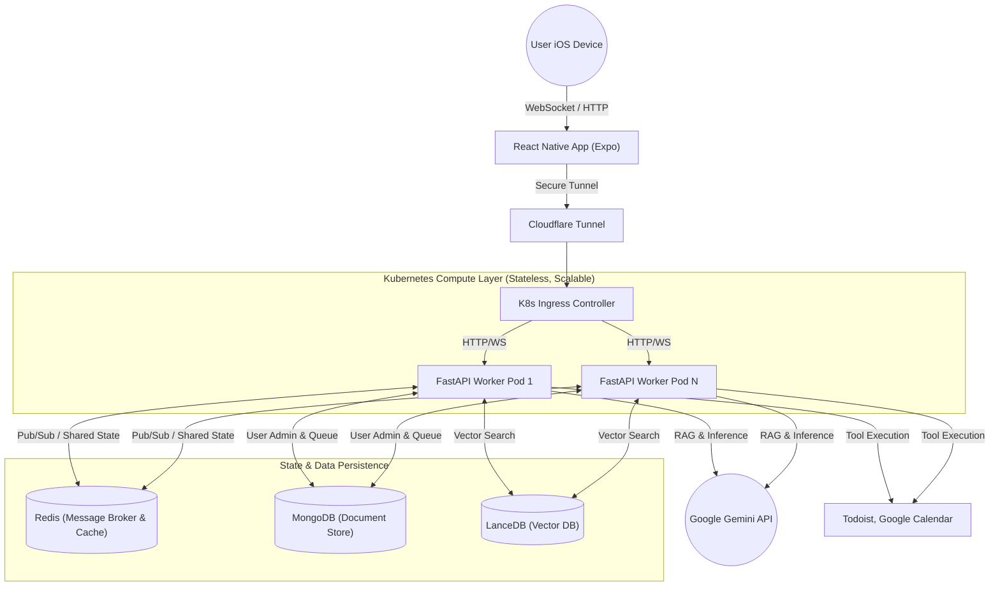

# PAgent: Your Autonomous iOS Personal Assistant

PAgent is an intelligent, context-aware mobile application acting as a true personal assistant. Built with a React Native (Expo) frontend for iOS and a containerized, scalable Python backend, PAgent doesn't just chat — it manages tasks, answers questions based on personal documents via a RAG pipeline, and schedules your day on your behalf.

PAgent was largely intended for providing busy individuals with a low-cost personal assistant, enabling offloading of responsibilities and mounting lists of tasks from limited and precious cognitive "RAM" and human memory capacity.

---

## 🎯 Key Features

- **🧠 Context-Aware AI**: Powered by Google Gemini and a custom LanceDB RAG (Retrieval-Augmented Generation) pipeline, PAgent answers queries referencing your personal uploaded documents and instructions.
- **📅 Action-Oriented Agent**: Integrates natively with Todoist and Google Calendar APIs (via OAuth 2.0/SAML/Google SSO), actively executing chores rather than just suggesting them.
- **⚡ Real-Time, Offline-Durable Communication**: Low-latency messaging via WebSockets, paired with robust message queuing and background push-notifications to ensure seamless sync when the app moves from background to foreground.
- **🔐 Secure Authentication**: Multi-provider authentication flows, backed by JWT-based route protection and automatic access/refresh token management.
- **📱 Rich Chat Interface**: Supports real-time markdown formatting preview (bold, italic, strikethrough) directly in the chat UI.
- **🔌 Flexible Integrations**: Easily connect, manage, and revoke third-party service connections (like Google Calendar) from a dedicated settings interface.

---

## 🏗️ System Architecture

The PAgent backend was meticulously designed around three core principles: **Cost Reduction, Learning, and Scalability**.

Currently, the entire backend is self-hosted on a **Raspberry Pi 400**. This extreme constraint (4GB RAM) forced the architecture to be as lightweight and stateless as possible, paving the way for massive horizontal scaling in the future.

### Architecture Flow

`iOS App ➔ Cloudflare Tunnel ➔ Kubernetes Ingress ➔ FastAPI Workers ➔ (Redis / MongoDB / LanceDB / Gemini)`

- **Stateless Design**: FastAPI Pods store zero local state. All active WebSocket connections, caches, and pending tasks are persisted to external stores.
- **Pub/Sub Backplane**: Redis handles message brokering across workers so a user's WebSocket connection on Pod A can receive background job completion events generated by Pod B.



---

## 🛠️ Technology Stack

**Frontend (Mobile)**

- React Native, TypeScript, Expo Framework
- WebSocket Client (`socket.io-client`)
- Native Modules for OAuth (`@react-native-google-signin/google-signin`)

**Backend (Microservices)**

- Python, FastAPI, Uvicorn, Gunicorn
- Google Gemini API SDK (LLM inference)
- `pypdf` (Document processing)
- Custom API Keys & Context Providers

**Data Storage & State Management**

- MongoDB (User Administration & Offline Message Queuing)
- Redis (WebSocket Pub/Sub & Shared Event State)
- LanceDB (Embedded Vector DB for RAG)
- _(Planned migration to Postgres with vector tracking)_

**Infrastructure & DevOps**

- Docker & Docker Compose Containerization
- Kubernetes (K3s/MicroK8s Orchestration)
- Self-Hosted GitHub Actions CI/CD Pipeline
- Cloudflare Tunnels (Secure Ingress routing)
- Firebase Cloud Messaging (FCM)
- Better Stack & Structlog (Structured Event Logging)

---

## 🧠 Engineering Challenges & Learnings

The choice to host PAgent on a Raspberry Pi 400 required tight resource optimization, particularly regarding RAM. Python worker processes (loading ML libraries like pandas, numpy, and LanceDB) consume substantial memory (~150-300MB idle). As such, I pushed all state to efficient data stores and am evaluating a full backend migration to **Rust (Axum/Actix)**, which would achieve up to a **90% reduction in idle RAM usage** and significantly lower CPU overhead.

### 1. The Cost-Constrained Architecture

**Context:** The entire backend (MongoDB, Redis, LanceDB, and FastAPI application) is initially self-hosted on a Raspberry Pi 400 to minimize cloud infrastructure costs.

**Challenge:** With limited memory (4GB RAM) and an ARM CPU, running a microservices architecture locally risks significant bottlenecks.

**Solution:** A lightweight, containerized setup via `docker-compose` (and orchestrated via Kubernetes) was chosen. State was rigorously externalized to efficient stores like Redis to keep Python worker overhead low. Due to the high idle memory consumption of Python workers with ML libraries, the system was designed to allow for a future drop-in replacement of the FastAPI backend with Rust.

### 2. Reliable Background/Offline Synchronization

**Challenge:** iOS aggressively suspends applications placed in the background or killed state. When the agent schedules tasks or attempts to message the user while the app is backgrounded, standard WebSocket connections drop, risking silent failures.

**Solution:** A durable dead-letter queue in MongoDB was implemented along with Firebase Cloud Messaging (FCM). When the server detects an offline state, Agent messages route into the user's database queue. Upon application foregrounding, the initial handshake triggers the server to flush the message queue over the newly established WebSocket, ensuring guaranteed state synchronization.

### 3. Stateless Real-Time Communication

**Challenge:** WebSockets are inherently stateful. In a highly available Kubernetes cluster, a user might connect to Pod A, while a long-running AI background job finishes execution on Pod B, breaking the communication pipeline.

**Solution:** The application architecture is completely stateless by design. Redis acts as an external Pub/Sub message broker. When any FastAPI worker pod needs to emit an event, it publishes the event to Redis. All connected worker pods subscribe to this broker, ensuring that the correct worker holding the client's WebSocket connection instantly receives and forwards the message to the App.

### 4. RAG Pipeline on the Edge

**Challenge:** Providing context-aware AI on personal documents requires a robust Retrieval-Augmented Generation pipeline without exhausting the Pi's RAM.

**Solution:** Integrated `LanceDB` directly into the project instead of a standalone, Client-Server database. LanceDB embeds its database process into the application process, eliminating communication overhead between the client and the database server. This avoids unnecessary memory bloat while providing fast vector search for user context, parsed using the `pypdf` library.

---

## 🚀 Future Roadmap & Ongoing Development

- **Database Consolidation**: Migrating from MongoDB and LanceDB to a unified Postgres instance utilizing Postgres' vector extension features.
- **Backend Rewrite**: A gradual, modular and complete migration from Python (FastAPI) to Rust to achieve dramatic memory optimizations and performance gains on constrained hardware.
- **Expanded Capabilities**: Continuing to deepen integration features (Slack, Notion) and enhancing local storage resiliency on end-user devices.
- **Private, Localized LLM**: Migrating to localized, lightweight, on-premises LLM models, such as Gemma by Google or Ollama by Meta, can allow for significant increase in privacy and transparency, and provide the user with fine-grained control over their personal data. Additionally, eliminating the need for billing-per-token due to API usage can also result in reduced costs.

---

## 🏁 Quick Start (Local Development)

### Prerequisites

- Docker & Docker Compose
- Node.js & npm (for Expo)
- Valid API Keys (Google Gemini, Todoist, Firebase, etc.) mapped in a `.env` file _(see `.env.example`)_.

### Running the Services

1. **Start the Backend Infrastructure:**
   ```bash
   cd backend
   docker compose up --build -d
   ```
2. **Start the Mobile Dev Server:**
   ```bash
   cd frontend
   npm install
   npx expo start
   ```
